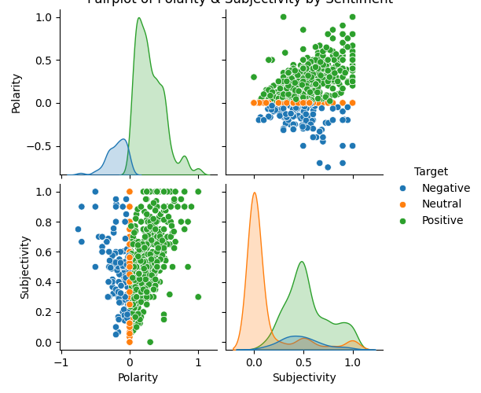

# 🧠 Twitter Sentiment Analysis on AstraZeneca Vaccine Tweets

This project performs sentiment analysis on tweets related to the AstraZeneca COVID-19 vaccine using natural language processing (NLP) and machine learning techniques. It classifies tweets as **positive**, **neutral**, or **negative**, and visualizes public sentiment using charts and word clouds. This analysis helps explore how people react to health-related issues on social media.

---

## 📁 Dataset

- **Source**: [Kaggle - Twitter AstraZeneca AntiCovid](https://www.kaggle.com/datasets/gallo33henrique/twitter-astrazeneca-anticovid)
- **Records**: 1,553 tweets
- **Attributes**:
  - `id`: Unique tweet ID
  - `Tweet`: The actual tweet text
  - `Polarity`: Sentiment score (from -1 to 1)
  - `Subjectivity`: Score (from 0 = objective to 1 = subjective)
  - `Target`: Labeled sentiment (Positive, Neutral, Negative)

---

## 🎥 Project Presentation

Watch our presentation: [Google Drive Link](https://drive.google.com/drive/folders/1Qu9OXXkZcK0_NJ1kGUJdtRl04HI8U3vr)

## 🚀 Project Workflow

### 1. **Data Preprocessing**
- Convert text to lowercase
- Remove URLs, punctuation, and stopwords
- Lemmatize words
- Resulting text is stored in a `Cleaned_Tweet` column

### 2. **Exploratory Data Analysis (EDA)**
- Calculate sentiment distribution
- Analyze polarity & subjectivity statistics
- Visualize:
 #### 📊 Polarity Distribution


#### 📊 Subjectivity Distribution


#### 🧩 Sentiment Pairplot


### 3. Word Clouds

#### 😊 Positive Tweets


#### 😐 Neutral Tweets


#### 😡 Negative Tweets


### 3. **Feature Extraction**
- Use `CountVectorizer` to convert tweets to numerical vectors
- Vocabulary size: 3,246 unique tokens

### 4. **Modeling**
- **Classifier used**: Multinomial Naive Bayes (MultinomialNB)
- Data split: 80% training, 20% testing
- Evaluation metrics:
  - Accuracy
  - Confusion Matrix
  - Precision, Recall, F1-score

---

## 📊 Results

- **Accuracy**: `68.8%`
- **Classification Report**:

| Sentiment | Precision | Recall | F1-score |
|-----------|-----------|--------|----------|
| Negative  | 0.583     | 0.259  | 0.359    |
| Neutral   | 0.694     | 0.684  | 0.689    |
| Positive  | 0.691     | 0.770  | 0.728    |

- **Insights**:
  - Most tweets are neutral or positive
  - Negative tweets were fewer and harder to classify
  - Subjectivity levels suggest tweets are mostly fact-based

---

## ✅ Conclusion & Recommendations

This project successfully demonstrated how natural language processing and machine learning can be used to analyze public sentiment on Twitter about the AstraZeneca COVID-19 vaccine. Using a simple yet effective approach with Multinomial Naive Bayes and CountVectorizer, we were able to classify tweets into positive, neutral, or negative sentiments with an accuracy of 68.8%.

While the model performed well on positive and neutral tweets, it had difficulty with negative tweets due to class imbalance. Despite that, our findings show that most users expressed neutral or positive opinions, and that tweets were generally more factual than emotional.

### 📌 Recommendations

- **Improve class balance**: Apply oversampling (e.g., SMOTE) to help the model better detect rare negative tweets.
- **Try advanced models**: Consider SVM, Logistic Regression, or even transformer-based models like BERT for better performance.
- **Feature tuning**: Experiment with CountVectorizer/TF-IDF parameters (e.g., n-grams, min_df).
- **Real-time monitoring**: Apply this approach to track ongoing public sentiment during health events, vaccine rollouts, or public crises.

##### This approach could be very useful for public health agencies, researchers, or social media analysts to track sentiment and make data-informed decisions.
---

## 🔧 Installation & Usage

### Prerequisites

- Python 3.7+
- Install dependencies:
  ```bash
  pip install pandas nltk scikit-learn matplotlib seaborn wordcloud plotly